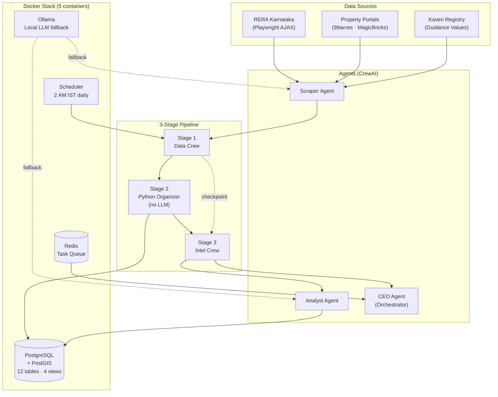

<div align="center">

# RE_OS — Real Estate Intelligence OS

**Autonomous multi-agent AI system for institutional-grade market intelligence on Indian real estate**

[](https://python.org)
[](https://docker.com)
[](https://crewai.com)
[](LICENSE)
[](https://github.com/jinujon007/RE_OS/actions/workflows/ci.yml)
[](https://github.com/jinujon007/RE_OS/commits/master)

[Quick Start](#quick-start) · [Architecture](#architecture) · [Features](#features) · [Docs](#documentation) · [Roadmap](#roadmap)

</div>

---

RE_OS is a five-agent AI system that autonomously scrapes RERA Karnataka, parses live property listings, stores structured geospatial data in PostGIS, and generates actionable micro-market intelligence briefs — ending with a single recommended strategic action per market.

**One command. Three markets. Full institutional briefing.**

```bash
docker compose exec agents python crews/market_intel_crew.py --market Yelahanka
```

> Built for North Bengaluru real estate decisions: **Yelahanka · Devanahalli · Hebbal**. Extensible to any RERA state.

---

## What It Does

The pipeline runs in three stages — no LLM touches the data before it is validated and stored:

| Stage | Agent | What Happens |
|-------|-------|-------------|
| **1 — Scrape** | Scraper Agent | Playwright intercepts RERA Karnataka AJAX; 99acres/MagicBricks listings pulled; Kaveri registration data fetched |
| **2 — Store** | Python Organizer | Records validated, deduplicated, batch-upserted to PostGIS (idempotent, UUID-keyed) |
| **3 — Brief** | Analyst + CEO | Pre-built DB views queried → absorption rate, PSF bands, Grade A competition → CEO synthesizes one strategic action for LLS |

---

## Architecture



**Checkpointing:** if Stage 1 ran today, Stage 3 restarts skip re-scraping. Failed runs resume from the last completed stage.

---

## Features

- **Multi-source scraping** — RERA Karnataka (Playwright AJAX intercept + POST fallback + hardcoded fallback), property portal listings, Kaveri registration data
- **Tiered LLM routing** — Cerebras → Groq → Gemini → NVIDIA → OpenRouter → Ollama. Free tier first, local fallback always available. A full three-market run costs $0.
- **PostGIS data store** — 12 tables with geospatial support, 4 pre-built analytics views (`v_market_inventory`, `v_developer_scorecard`, `v_market_brief`, `v_active_projects`)
- **Developer grading** — automatic A/B/C classification: Grade A = recognised brand or ≥500 units; B = 100–499; C = <100
- **Checkpointed pipeline** — today's Stage 1 checkpoint means failed runs restart from Stage 3 only
- **Autonomous scheduling** — APScheduler runs RERA refresh at 2 AM IST daily; market snapshots at 6 AM
- **Scout Division** — four specialised scouts built: News Scout, Portal Scout, Developer Scout, RERA Detail Scout (integration in progress)
- **Multi-brain dev protocol** — Claude Code (architect), Cline (implementer), Kilo Code (audit) co-develop via `TASK_QUEUE.md`

---

## Quick Start

### Prerequisites

- [Docker Desktop](https://www.docker.com/products/docker-desktop/) running
- At least one LLM API key (Groq free tier recommended — no card, no phone required)

### 1. Clone and configure

```bash
git clone https://github.com/jinujon007/RE_OS.git
cd RE_OS
cp .env.example .env
```

Open `.env` and add your `GROQ_API_KEY` (minimum). Get one free at [console.groq.com](https://console.groq.com).

### 2. Start the stack

```bash
docker compose up -d
docker compose ps   # all 5 containers should show "running"
```

First boot: ~3–5 minutes (image pulls + database init). Subsequent boots: ~15 seconds.

### 3. Pull the local LLM (one-time, ~5 GB)

```bash
docker compose exec ollama ollama pull llama3.1:8b
```

This gives you an unlimited local fallback. Skip if you have sufficient API quota.

### 4. Run your first intelligence scan

```bash
docker compose exec agents python crews/market_intel_crew.py --market Yelahanka
```

Total runtime: 3–5 minutes per market. Report saved to `outputs/yelahanka/intel_report_YYYYMMDD_HHMM.txt`.

### 5. Query the database directly

```bash
docker compose exec postgres psql -U re_os_user -d re_os
```

```sql
SELECT * FROM v_market_inventory;        -- absorption, PSF, active units
SELECT * FROM v_developer_scorecard;     -- developer rankings
SELECT * FROM v_active_projects LIMIT 20;
```

---

## Configuration

All configuration lives in `.env`. Copy `.env.example` to get started.

| Variable | Required | Default | Description |
|----------|----------|---------|-------------|
| `GROQ_API_KEY` | Recommended | — | CEO agent (primary). Free at [console.groq.com](https://console.groq.com) |
| `CEREBRAS_API_KEY` | Optional | — | Scraper + Analyst (1M tokens/day free). [cloud.cerebras.ai](https://cloud.cerebras.ai) |
| `GEMINI_API_KEY` | Optional | — | CEO fallback. [aistudio.google.com](https://aistudio.google.com) |
| `NVIDIA_API_KEY` | Optional | — | 405B model, 40 req/min free. [build.nvidia.com](https://build.nvidia.com) |
| `OPENROUTER_API_KEY` | Optional | — | Last-resort fallback. [openrouter.ai](https://openrouter.ai) |
| `TARGET_MARKETS` | Optional | `Yelahanka,Devanahalli,Hebbal` | Comma-separated market names |
| `DB_PASSWORD` | Optional | `re_os_2024` | PostgreSQL password |
| `OLLAMA_MODEL` | Optional | `llama3.1:8b` | Local model name |
| `LOG_LEVEL` | Optional | `INFO` | Logging verbosity |

---

## LLM Routing

RE_OS routes across three tiers, falling back gracefully when a provider is rate-limited or unavailable:

```
HEAVY  (CEO Agent):       Groq Scout 17b → Gemini 2.5 Flash → NVIDIA 405b → OpenRouter 70b → Ollama
ANALYSIS (Analyst Agent): Cerebras 8b → Groq Scout → Ollama
LIGHT  (Scraper Agent):   Cerebras 8b → Gemini Gemma 27b → NVIDIA 70b → Ollama
```

Cerebras and Groq are completely separate budgets — no TPM conflicts between tiers. See [`config/llm_router.py`](config/llm_router.py) and [`MODELS.md`](MODELS.md) for capacity math.

---

## Database Schema

12 tables (UUID primary keys, PostGIS geometry support):

`micro_markets` · `developers` · `rera_projects` · `project_snapshots` · `listings` · `kaveri_registrations` · `guidance_values` · `regulatory_zones` · `overlay_constraints` · `infrastructure_pipeline` · `market_snapshots` · `agent_runs`

**Pre-built analytics views:**

| View | What It Shows |
|------|--------------|
| `v_market_inventory` | Active units, PSF range, absorption rate per micro-market |
| `v_active_projects` | All live RERA projects with developer grade and status |
| `v_developer_scorecard` | Developer ranking by units, grade, project count |
| `v_market_brief` | Combined brief ready for Analyst Agent queries |

Full schema: [`database/schema.sql`](database/schema.sql)

---

## Run Commands

```bash
# ── STACK ─────────────────────────────────────────────────────────────
docker compose up -d                           # start all 5 containers
docker compose ps                              # check status
docker compose down                            # stop (data preserved)
docker compose down -v                         # stop + wipe DB (careful)

# ── PIPELINE ──────────────────────────────────────────────────────────
docker compose exec agents python crews/market_intel_crew.py --market Yelahanka
docker compose exec agents python crews/market_intel_crew.py --market Devanahalli
docker compose exec agents python crews/market_intel_crew.py --market Hebbal
docker compose exec agents python crews/market_intel_crew.py   # all markets

# ── STANDALONE SCRAPERS ───────────────────────────────────────────────
docker compose exec agents python scrapers/rera_karnataka.py --market Yelahanka

# ── LOGS ──────────────────────────────────────────────────────────────
docker compose logs agents --tail 50
docker compose exec agents python config/run_logger.py   # run history

# ── REBUILD (after Dockerfile or requirements.txt changes) ────────────
docker compose build agents && docker compose up -d agents
```

---

## Target Markets

| Market | Focus | RERA Coverage |
|--------|-------|---------------|
| Yelahanka | Established residential, strong Grade A presence | ✅ |
| Devanahalli | Airport corridor, emerging premium segment | ✅ |
| Hebbal | North Bengaluru gateway, mixed-use | ✅ |

Extending to a new market: add keywords to `config/settings.py → MARKET_RERA_KEYWORDS`, update `TARGET_MARKETS` in `.env`. The schema already supports multi-city — `micro_markets` table has `city` and `state` columns.

---

## Documentation

| File | What It Covers |
|------|----------------|
| [HOW_TO_RUN.md](HOW_TO_RUN.md) | Daily operation — every command, every error, every fix |
| [SETUP.md](SETUP.md) | First-time setup from zero to first run |
| [VISION.md](VISION.md) | 14-phase roadmap to full Virtual Real Estate Office |
| [AGENTS.md](AGENTS.md) | Agent roles, task protocol, multi-brain dev workflow |
| [MODELS.md](MODELS.md) | Free model reference and daily capacity math |
| [DEVLOG.md](DEVLOG.md) | Phase-by-phase build history |
| [CHANGELOG.md](CHANGELOG.md) | File-level change log |

---

## Roadmap

```
✅ Phase 0  Core pipeline — RERA scraper, PostGIS, CEO + Analyst agents
✅ Phase 1  Scout Division — News, Portal, Developer, RERA Detail scouts (built)
🔄 Phase 2  Scout integration — wire all 4 scouts into pipeline + dedup
⏳ Phase 3  Dashboard — Flask + live agent status + scout feed
⏳ Phase 4  Sentinel Agent — system health monitoring + alerts
⏳ Phase 5  Finance Department — feasibility analyst + GDV modelling
⏳ Phase 6  Mission Control UI — org chart, direct comms, Board Room
⏳ Phase 7  PR & Brand Department — content + social media agents
⏳ Phase 8  Legal Department — RERA compliance, title risk agents
⏳ Phase 9+ Full Virtual RE Office — all departments, hiring system, Board of Shareholders
```

Full vision: [VISION.md](VISION.md)

---

## Contributing

See [CONTRIBUTING.md](.github/CONTRIBUTING.md). Issues and PRs welcome.

For bugs: include `docker compose logs agents --tail 50` output.
For features: check [VISION.md](VISION.md) first — most planned work is already specced.

---

## License

MIT — see [LICENSE](LICENSE).

---

<div align="center">

Built for [Land & Life Space](https://landlifespace.in) · Bengaluru, India

*Real estate intelligence that compounds.*

</div>
