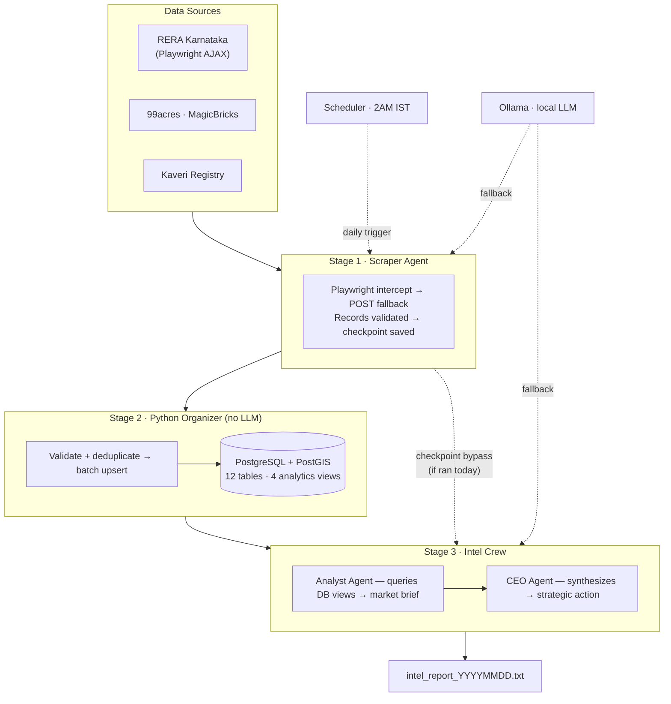

<div align="center">

# RE_OS — Real Estate Intelligence OS

**Autonomous multi-agent AI system for institutional-grade market intelligence on Indian real estate**

[](https://python.org)
[](https://docker.com)
[](https://crewai.com)
[](LICENSE)
[](https://github.com/jinujon007/RE_OS/actions/workflows/ci.yml)
[](https://github.com/jinujon007/RE_OS/stargazers)

[Quick Start](#quick-start) · [Architecture](#architecture) · [Features](#features) · [Docs](#documentation) · [Roadmap](#roadmap)

</div>

---

RE_OS is a five-agent AI system that autonomously scrapes RERA Karnataka, parses live property listings, stores structured geospatial data in PostGIS, and generates actionable micro-market intelligence briefs — ending with a single recommended strategic action per market.

**One command. Three markets. Full institutional briefing.**

```bash
docker compose exec agents python crews/market_intel_crew.py --market Yelahanka
```

> Built for North Bengaluru real estate decisions: **Yelahanka · Devanahalli · Hebbal**. Extensible to any RERA state.

---

## The Problem

RERA Karnataka publishes project data through a JavaScript-rendered portal with no public API. Listing portals scatter PSF and inventory data across hundreds of pages. Kaveri registration data sits in a separate system entirely. A developer trying to answer "what is Grade A inventory doing in Yelahanka this quarter?" needs to manually pull from three sources, clean the data, and reconcile it — a process that takes hours and goes stale immediately.

RE_OS automates the entire loop: scrape → store → query → brief. The output is a structured market brief with a single recommended action, refreshed nightly.

---

## Sample Output

<details>
<summary>Click to expand — Yelahanka intelligence brief</summary>

```
── YELAHANKA INTELLIGENCE BRIEF  ·  2026-05-19 02:17 IST ─────────────────────

MARKET SNAPSHOT
  Active RERA projects     : 47   (Grade A: 12 · B: 21 · C: 14)
  Total inventory          : 4,280 units
  Available units          : 2,940  (69% unsold)
  Price range (all grades) : ₹5,200 – ₹9,400 PSF
  Grade A price band       : ₹7,500 – ₹9,400 PSF
  90-day absorption        : 18.4 units/month  (12M trailing avg)
  New launches (90 days)   : 6 projects · 1,240 units

GRADE A COMPETITION
  Godrej Properties   · 3 projects · 680 units · avg ₹8,200 PSF
  Prestige Group      · 2 projects · 410 units · avg ₹8,800 PSF
  Sobha Ltd           · 1 project  · 240 units · avg ₹9,100 PSF

SIGNALS
  ⚠  Supply elevated: Grade A inventory added 920 units in 90 days
  ✓  Absorption steady: no deterioration vs prior quarter
  ✓  Guidance value: ₹4,800 PSF (Yelahanka New Town) — 38% below market

CEO RECOMMENDATION
  Grade A band is supply-heavy. Absorption is stable but 6 new Grade A
  launches in 90 days will compress margins at ₹7,500+. Entry at
  ₹6,200–₹6,800 PSF captures demand below the Grade A saturation zone
  while maintaining headroom to price up as supply clears.

  Sources: RERA Karnataka (47 projects) · 99acres (312 listings)
  Stage 1: 3m 42s  ·  Stage 2: 0m 31s  ·  Stage 3: 1m 18s
───────────────────────────────────────────────────────────────────────────────
```

</details>

---

## What It Does

The pipeline runs in three stages — no LLM touches the data before it is validated and stored:

| Stage | What Happens |
|-------|-------------|
| **1 — Scrape** | Playwright intercepts RERA Karnataka AJAX; 99acres/MagicBricks listings pulled; Kaveri registration data fetched. Checkpoint saved to disk. |
| **2 — Store** | Records validated, deduplicated, batch-upserted to PostGIS (idempotent, UUID-keyed). Pure Python — no LLM. |
| **3 — Brief** | Pre-built DB views queried → absorption rate, PSF bands, Grade A competition → CEO synthesizes one strategic action. |

---

## Architecture



---

## Features

- **Multi-source scraping** — RERA Karnataka (Playwright AJAX intercept + POST fallback + hardcoded fallback), property portal listings, Kaveri registration and guidance value data
- **Tiered LLM routing** — Cerebras → Groq → Gemini → NVIDIA → OpenRouter → Ollama. Free tier first, local fallback always available. A full three-market run costs $0.
- **PostGIS data store** — 12 tables with geospatial support, 4 pre-built analytics views (`v_market_inventory`, `v_developer_scorecard`, `v_market_brief`, `v_active_projects`)
- **Developer grading** — automatic A/B/C classification: Grade A = recognised brand or ≥500 units; B = 100–499; C = <100
- **Checkpointed pipeline** — today's Stage 1 checkpoint means failed runs restart from Stage 3; no re-scraping
- **Autonomous scheduling** — APScheduler runs RERA refresh at 2 AM IST daily; market snapshots at 6 AM
- **Scout Division** — four specialised scouts built and awaiting integration: News Scout, Portal Scout, Developer Scout, RERA Detail Scout

---

## Quick Start

### Prerequisites

- [Docker Desktop](https://www.docker.com/products/docker-desktop/) running
- At least one LLM API key — Groq free tier recommended (no card, no phone required)

### 1. Clone and configure

```bash
git clone https://github.com/jinujon007/RE_OS.git
cd RE_OS
cp .env.example .env
```

Open `.env` and add your `GROQ_API_KEY`. Get one free at [console.groq.com](https://console.groq.com).

### 2. Start the stack

```bash
docker compose up -d
docker compose ps   # all 5 containers should show "running"
```

First boot: ~3–5 minutes (image pulls + database init). Subsequent boots: ~15 seconds.

### 3. Pull the local LLM (one-time, ~5 GB — optional)

```bash
docker compose exec ollama ollama pull llama3.1:8b
```

Gives you an unlimited local fallback. Skip if you have sufficient API quota.

### 4. Run your first intelligence scan

```bash
docker compose exec agents python crews/market_intel_crew.py --market Yelahanka
```

Total runtime: 3–5 minutes per market. Report saved to `outputs/yelahanka/intel_report_YYYYMMDD_HHMM.txt`.

### 5. Query the database directly

```bash
docker compose exec postgres psql -U re_os_user -d re_os
```

```sql
SELECT * FROM v_market_inventory;        -- absorption, PSF, active units
SELECT * FROM v_developer_scorecard;     -- developer rankings
SELECT * FROM v_active_projects LIMIT 20;
```

---

## Configuration

All configuration lives in `.env`. Copy `.env.example` to get started.

| Variable | Required | Default | Description |
|----------|----------|---------|-------------|
| `GROQ_API_KEY` | Recommended | — | CEO agent primary. Free at [console.groq.com](https://console.groq.com) |
| `CEREBRAS_API_KEY` | Optional | — | Scraper + Analyst (1M tokens/day free). [cloud.cerebras.ai](https://cloud.cerebras.ai) |
| `GEMINI_API_KEY` | Optional | — | CEO fallback. [aistudio.google.com](https://aistudio.google.com) |
| `NVIDIA_API_KEY` | Optional | — | 405B model, 40 req/min free. [build.nvidia.com](https://build.nvidia.com) |
| `OPENROUTER_API_KEY` | Optional | — | Last-resort fallback. [openrouter.ai](https://openrouter.ai) |
| `TARGET_MARKETS` | Optional | `Yelahanka,Devanahalli,Hebbal` | Comma-separated market names |
| `DB_PASSWORD` | Optional | `re_os_2024` | PostgreSQL password |
| `OLLAMA_MODEL` | Optional | `llama3.1:8b` | Local model name |

---

## LLM Routing

RE_OS routes across three tiers, falling back gracefully when a provider is rate-limited:

```
HEAVY    (CEO Agent):       Groq Scout 17b → Gemini 2.5 Flash → NVIDIA 405b → OpenRouter 70b → Ollama
ANALYSIS (Analyst Agent):  Cerebras 8b    → Groq Scout        → Ollama
LIGHT    (Scraper Agent):  Cerebras 8b    → Gemini Gemma 27b  → NVIDIA 70b  → Ollama
```

Cerebras and Groq are separate budgets — no TPM conflicts between tiers. See [`config/llm_router.py`](config/llm_router.py) and [`MODELS.md`](MODELS.md) for daily capacity math.

---

## Database Schema

12 tables (UUID primary keys, PostGIS geometry support):

`micro_markets` · `developers` · `rera_projects` · `project_snapshots` · `listings` · `kaveri_registrations` · `guidance_values` · `regulatory_zones` · `overlay_constraints` · `infrastructure_pipeline` · `market_snapshots` · `agent_runs`

**Pre-built analytics views:**

| View | What It Shows |
|------|--------------|
| `v_market_inventory` | Active units, PSF range, absorption rate per micro-market |
| `v_active_projects` | All live RERA projects with developer grade and status |
| `v_developer_scorecard` | Developer ranking by units, grade, project count |
| `v_market_brief` | Combined brief ready for Analyst Agent queries |

Full schema: [`database/schema.sql`](database/schema.sql)

---

## Run Commands

```bash
# ── STACK ──────────────────────────────────────────────────────────────────
docker compose up -d                           # start all 5 containers
docker compose ps                              # check status
docker compose down                            # stop (data preserved)
docker compose down -v                         # stop + wipe DB

# ── PIPELINE ───────────────────────────────────────────────────────────────
docker compose exec agents python crews/market_intel_crew.py --market Yelahanka
docker compose exec agents python crews/market_intel_crew.py --market Devanahalli
docker compose exec agents python crews/market_intel_crew.py --market Hebbal
docker compose exec agents python crews/market_intel_crew.py   # all markets

# ── STANDALONE SCRAPERS ────────────────────────────────────────────────────
docker compose exec agents python scrapers/rera_karnataka.py --market Yelahanka

# ── LOGS ───────────────────────────────────────────────────────────────────
docker compose logs agents --tail 50
docker compose exec agents python config/run_logger.py   # run history table

# ── REBUILD (after Dockerfile / requirements.txt changes) ──────────────────
docker compose build agents && docker compose up -d agents
```

---

## Target Markets

| Market | Character | RERA Coverage |
|--------|-----------|---------------|
| Yelahanka | Established residential, strong Grade A presence | ✅ |
| Devanahalli | Airport corridor, emerging premium segment | ✅ |
| Hebbal | North Bengaluru gateway, mixed-use | ✅ |

**Adding a new market:** add keywords to `config/settings.py → MARKET_RERA_KEYWORDS`, update `TARGET_MARKETS` in `.env`. The schema already supports multi-city (`micro_markets` table has `city` and `state` columns).

---

## Documentation

| File | What It Covers |
|------|----------------|
| [HOW_TO_RUN.md](HOW_TO_RUN.md) | Daily operation — every command, every error, every fix |
| [SETUP.md](SETUP.md) | First-time setup from zero to first run |
| [VISION.md](VISION.md) | 14-phase roadmap to full Virtual Real Estate Office |
| [MODELS.md](MODELS.md) | Free model reference and daily capacity math |
| [CHANGELOG.md](CHANGELOG.md) | File-level change log |

---

## Roadmap

- [x] **Phase 0** — Core pipeline: RERA scraper, PostGIS, CEO + Analyst agents
- [x] **Phase 1** — Scout Division: News, Portal, Developer, RERA Detail scouts (built)
- [ ] **Phase 2** — Scout integration: wire all 4 scouts into pipeline + dedup
- [ ] **Phase 3** — Dashboard: Flask + live agent status + scout feed
- [ ] **Phase 4** — Sentinel Agent: system health monitoring + alerts
- [ ] **Phase 5** — Finance Department: feasibility analyst + GDV modelling
- [ ] **Phase 6** — Mission Control UI: org chart, direct comms, Board Room
- [ ] **Phase 7** — PR & Brand Department: content + social media agents
- [ ] **Phase 8** — Legal Department: RERA compliance, title risk agents
- [ ] **Phase 9+** — Full Virtual RE Office: all departments, hiring system, Board of Shareholders

Full vision and phase specs: [VISION.md](VISION.md)

---

## Contributing

See [CONTRIBUTING.md](.github/CONTRIBUTING.md). Issues and PRs welcome.

For bugs: include `docker compose logs agents --tail 50` output.
For features: check [VISION.md](VISION.md) first — most planned work is already specced.

---

## License

MIT — see [LICENSE](LICENSE).

---

<div align="center">

Built for [Land & Life Space](https://landlifespace.in) · Bengaluru, India

*Real estate intelligence that compounds.*

</div>
