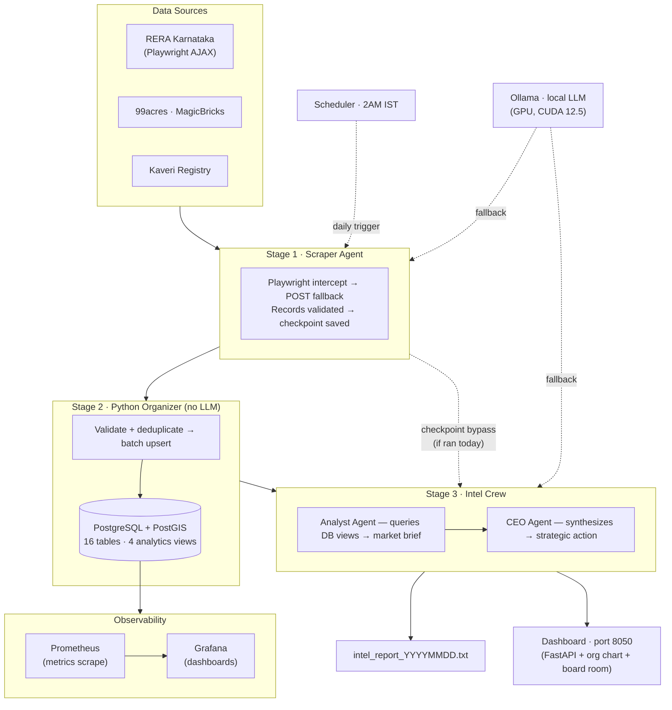

<div align="center">

# RE_OS — Real Estate Intelligence OS

**Autonomous multi-agent AI system for institutional-grade market intelligence on Indian real estate**

[](https://python.org)
[](https://docker.com)
[](https://crewai.com)
[](https://fastapi.tiangolo.com)
[](LICENSE)
[](https://github.com/jinujon007/RE_OS/actions/workflows/ci.yml)
[](https://github.com/jinujon007/RE_OS/stargazers)

[Quick Start](#quick-start) · [Architecture](#architecture) · [Features](#features) · [Dashboard](#dashboard) · [Docs](#documentation) · [Roadmap](#roadmap)

</div>

---

RE_OS is a multi-agent AI system that autonomously scrapes RERA Karnataka, parses live property listings, stores structured geospatial data in PostGIS, and generates actionable micro-market intelligence briefs — ending with a single recommended strategic action per market.

**One command. Three markets. Full institutional briefing.**

```bash
docker compose exec agents python crews/market_intel_crew.py --market Yelahanka
```

> Built for North Bengaluru real estate decisions: **Yelahanka · Devanahalli · Hebbal**. Extensible to any RERA state.

---

## The Problem

RERA Karnataka publishes project data through a JavaScript-rendered portal with no public API. Listing portals scatter PSF and inventory data across hundreds of pages. Kaveri registration data sits in a separate system entirely. A developer trying to answer "what is Grade A inventory doing in Yelahanka this quarter?" needs to manually pull from three sources, clean the data, and reconcile it — a process that takes hours and goes stale immediately.

RE_OS automates the entire loop: scrape → store → query → brief. The output is a structured market brief with a single recommended action, refreshed nightly.

---

## Sample Output

<details>
<summary>Click to expand — Yelahanka intelligence brief</summary>

```
── YELAHANKA INTELLIGENCE BRIEF  ·  2026-05-19 02:17 IST ─────────────────────

MARKET SNAPSHOT
  Active RERA projects     : 47   (Grade A: 12 · B: 21 · C: 14)
  Total inventory          : 4,280 units
  Available units          : 2,940  (69% unsold)
  Price range (all grades) : ₹5,200 – ₹9,400 PSF
  Grade A price band       : ₹7,500 – ₹9,400 PSF
  90-day absorption        : 18.4 units/month  (12M trailing avg)
  New launches (90 days)   : 6 projects · 1,240 units

GRADE A COMPETITION
  Godrej Properties   · 3 projects · 680 units · avg ₹8,200 PSF
  Prestige Group      · 2 projects · 410 units · avg ₹8,800 PSF
  Sobha Ltd           · 1 project  · 240 units · avg ₹9,100 PSF

SIGNALS
  ⚠  Supply elevated: Grade A inventory added 920 units in 90 days
  ✓  Absorption steady: no deterioration vs prior quarter
  ✓  Guidance value: ₹4,800 PSF (Yelahanka New Town) — 38% below market

CEO RECOMMENDATION
  Grade A band is supply-heavy. Absorption is stable but 6 new Grade A
  launches in 90 days will compress margins at ₹7,500+. Entry at
  ₹6,200–₹6,800 PSF captures demand below the Grade A saturation zone
  while maintaining headroom to price up as supply clears.

  Sources: RERA Karnataka (47 projects) · 99acres (312 listings)
  Stage 1: 3m 42s  ·  Stage 2: 0m 31s  ·  Stage 3: 1m 18s
───────────────────────────────────────────────────────────────────────────────
```

</details>

---

## What It Does

The pipeline runs in three stages — no LLM touches the data before it is validated and stored:

| Stage | What Happens |
|-------|-------------|
| **1 — Scrape** | Playwright intercepts RERA Karnataka AJAX; 99acres/MagicBricks listings pulled; Kaveri registration data fetched. Checkpoint saved to disk. |
| **2 — Store** | Records validated, deduplicated, batch-upserted to PostGIS (idempotent, UUID-keyed). Pure Python — no LLM. |
| **3 — Brief** | Pre-built DB views queried → absorption rate, PSF bands, Grade A competition → CEO synthesizes one strategic action. |

On top of the core pipeline, RE_OS ships a complete **virtual real estate office**:

- **Dashboard (port 8050)** — org chart, intel board, task board, live log stream, DB explorer, Board Room sessions
- **Board Room** — 5 department heads (BD / Finance / Engineering / Ops / Legal) run concurrently on any acquisition pitch; auto-computes IRR, FSI, zone risk, RERA compliance, and outputs a structured deal memo
- **Intelligence Layer** — ChromaDB semantic search across all past intel reports; FinBERT sentiment scoring on news; BGE-M3 embeddings; cross-encoder reranking
- **Agent Hiring** — define new specialist agents in YAML and hire them from the dashboard with no code change
- **Prometheus + Grafana** — built-in observability stack, auto-provisioned datasource and dashboard

---

## Architecture



---

## Features

- **Multi-source scraping** — RERA Karnataka (Playwright AJAX intercept + POST fallback), property portal listings (99acres, MagicBricks, Housing, NoBroker via Scrapling TLS-spoofing), Kaveri registration and guidance value data
- **Tiered LLM routing** — Cerebras → Groq → Gemini → NVIDIA → SambaNova → OpenRouter → Cloudflare → Ollama. Free tier first, local fallback always available. A full three-market run costs $0.
- **PostGIS data store** — 16 tables with geospatial support, 4 pre-built analytics views (`v_market_inventory`, `v_developer_scorecard`, `v_market_brief`, `v_active_projects`)
- **Developer grading** — automatic A/B/C classification: Grade A = recognised brand or ≥500 units; B = 100–499; C = <100
- **Board Room** — 5 concurrent department heads (BD / Finance / Engineering / Ops / Legal) evaluate any land acquisition; auto-IRR from live DB data, FSI calculation, zone risk, RERA compliance check
- **Intelligence Layer** — ChromaDB semantic search across all past reports; FinBERT sentiment on news articles; BGE-M3 embeddings; cross-encoder reranking
- **Dashboard (port 8050)** — FastAPI server with org chart, intel board, task board, DB explorer, Board Room session history, live log stream; Prometheus `/metrics` endpoint
- **Agent Memory** — per-agent confidence-weighted memory with configurable decay; injected into pipeline context automatically
- **Agent Hiring** — YAML agent registry; hire specialist agents from the dashboard without Python changes or Docker rebuilds
- **Checkpointed pipeline** — today's Stage 1 checkpoint means failed runs restart from Stage 3; no re-scraping
- **Autonomous scheduling** — APScheduler runs RERA refresh at 2 AM IST daily; market snapshots at 6 AM; embedding + sentiment jobs at 4:30–5 AM
- **Observability** — Prometheus + Grafana pre-configured in docker-compose; anonymous admin access to dashboards out of the box
- **Scout Division** — six specialised scouts: RERA Karnataka, RERA Detail, Portal, Developer, News, Kaveri. SHA-based dedup via ScoutMemory.

---

## Quick Start

### Prerequisites

- [Docker Desktop](https://www.docker.com/products/docker-desktop/) running
- At least one LLM API key — Groq free tier recommended (no card, no phone required)

### 1. Clone and configure

```bash
git clone https://github.com/jinujon007/RE_OS.git
cd RE_OS
cp .env.example .env
```

Open `.env` and add your `GROQ_API_KEY`. Get one free at [console.groq.com](https://console.groq.com).

### 2. Start the stack

```bash
docker compose up -d
docker compose ps   # all 7 containers should show "running"
```

First boot: ~3–5 minutes (image pulls + database init). Subsequent boots: ~15 seconds.

Containers started: `re_os_db` (PostGIS) · `re_os_ollama` · `re_os_redis` · `re_os_agents` (FastAPI + crews) · `re_os_scheduler` (APScheduler) · `re_os_prometheus` · `re_os_grafana`

### 3. Pull the local LLM (one-time, ~5 GB — optional)

```bash
docker compose exec ollama ollama pull llama3.1:8b
```

Gives you an unlimited local fallback. Skip if you have sufficient API quota.

### 4. Run your first intelligence scan

```bash
docker compose exec agents python crews/market_intel_crew.py --market Yelahanka
```

Total runtime: 3–5 minutes per market. Report saved to `outputs/yelahanka/intel_report_YYYYMMDD_HHMM.txt`.

### 5. Query the database directly

```bash
docker compose exec postgres psql -U re_os_user -d re_os
```

```sql
SELECT * FROM v_market_inventory;        -- absorption, PSF, active units
SELECT * FROM v_developer_scorecard;     -- developer rankings
SELECT * FROM v_active_projects LIMIT 20;
```

---

## Configuration

All configuration lives in `.env`. Copy `.env.example` to get started.

| Variable | Required | Default | Description |
|----------|----------|---------|-------------|
| `GROQ_API_KEY` | Recommended | — | CEO agent primary. Free at [console.groq.com](https://console.groq.com) |
| `CEREBRAS_API_KEY` | Optional | — | Scraper + Analyst (1M tokens/day free). [cloud.cerebras.ai](https://cloud.cerebras.ai) |
| `GEMINI_API_KEY` | Optional | — | CEO fallback. [aistudio.google.com](https://aistudio.google.com) |
| `NVIDIA_API_KEY` | Optional | — | 405B model, 40 req/min free. [build.nvidia.com](https://build.nvidia.com) |
| `OPENROUTER_API_KEY` | Optional | — | Last-resort fallback. [openrouter.ai](https://openrouter.ai) |
| `TARGET_MARKETS` | Optional | `Yelahanka,Devanahalli,Hebbal` | Comma-separated market names |
| `DB_PASSWORD` | **Required** | — | PostgreSQL password — set before first `docker compose up` |
| `OLLAMA_MODEL` | Optional | `llama3.1:8b` | Local model name |

---

## LLM Routing

RE_OS routes across three tiers, falling back gracefully when a provider is rate-limited:

```
HEAVY    (CEO Agent):       Groq Scout 17b → Gemini 2.5 Flash → NVIDIA 405b → OpenRouter 70b → Ollama
ANALYSIS (Analyst Agent):  Cerebras 8b    → Groq Scout        → Ollama
LIGHT    (Scraper Agent):  Cerebras 8b    → Gemini Gemma 27b  → NVIDIA 70b  → Ollama
```

Cerebras and Groq are separate budgets — no TPM conflicts between tiers. See [`config/llm_router.py`](config/llm_router.py) and [`MODELS.md`](MODELS.md) for daily capacity math.

---

## Dashboard

Open `http://localhost:8050` after `docker compose up -d`.

| Panel | What It Shows |
|-------|--------------|
| **Org Chart** | All active agents and their roles; hire new agents from YAML templates |
| **Intel Board** | Latest market briefs per market; semantic search across all past reports |
| **Task Board** | Board Room session history; approve/reject department recommendations |
| **DB Explorer** | Live queries against analytics views — no psql required |
| **Log Stream** | Tail `crew.log` in-browser |
| **Metrics** | `GET /metrics` — Prometheus scrape endpoint |

Board Room: `POST /api/board/run` with `{"market": "Yelahanka", "pitch": "5-acre R2 site, target launch ₹6,500 PSF"}` → 5-dept concurrent evaluation → structured deal memo in ~90 seconds.

Grafana dashboards: `http://localhost:3000` (anonymous admin, pre-provisioned RE_OS dashboard).

---

## Database Schema

16 tables (UUID primary keys, PostGIS geometry support):

`micro_markets` · `developers` · `rera_projects` · `project_snapshots` · `listings` · `kaveri_registrations` · `guidance_values` · `regulatory_zones` · `overlay_constraints` · `infrastructure_pipeline` · `market_snapshots` · `agent_runs` · `news_articles` · `board_sessions` · `agent_memories` · `tasks`

**Pre-built analytics views:**

| View | What It Shows |
|------|--------------|
| `v_market_inventory` | Active units, PSF range, absorption rate, months-of-supply per micro-market |
| `v_active_projects` | All live RERA projects with developer grade, delay status, distress score |
| `v_developer_scorecard` | Developer ranking by units, grade, project count, absorption rate |
| `v_market_brief` | Combined brief ready for Analyst Agent queries |

Full schema: [`database/schema.sql`](database/schema.sql) · Migrations: [`alembic/versions/`](alembic/versions/)

---

## Run Commands

```bash
# ── STACK ──────────────────────────────────────────────────────────────────
docker compose up -d                           # start all 7 containers
docker compose ps                              # check status
docker compose down                            # stop (data preserved)
docker compose down -v                         # stop + wipe DB

# ── PIPELINE ───────────────────────────────────────────────────────────────
docker compose exec agents python crews/market_intel_crew.py --market Yelahanka
docker compose exec agents python crews/market_intel_crew.py --market Devanahalli
docker compose exec agents python crews/market_intel_crew.py --market Hebbal
docker compose exec agents python crews/market_intel_crew.py   # all markets

# ── STANDALONE SCRAPERS ────────────────────────────────────────────────────
docker compose exec agents python scrapers/rera_karnataka.py --market Yelahanka

# ── LOGS ───────────────────────────────────────────────────────────────────
docker compose logs agents --tail 50
docker compose exec agents python config/run_logger.py   # run history table

# ── REBUILD (after Dockerfile / requirements.txt changes) ──────────────────
docker compose build agents && docker compose up -d agents
```

---

## Shortcuts (`make`)

A `Makefile` wraps the most common commands. Requires `make` installed.

| Target | What It Does |
|--------|-------------|
| `make up` | `docker compose up -d` |
| `make down` | `docker compose down` |
| `make ps` | `docker compose ps` |
| `make logs` | Tail agents container logs |
| `make rebuild` | Rebuild agents image and restart |
| `make run` | Run all markets |
| `make run-yelahanka` | Run Yelahanka only |
| `make run-devanahalli` | Run Devanahalli only |
| `make run-hebbal` | Run Hebbal only |
| `make db` | Open psql shell |
| `make db-inventory` | Print `v_market_inventory` |
| `make db-projects` | Print `v_active_projects` (20 rows) |
| `make db-developers` | Print `v_developer_scorecard` |
| `make test` | Run unit test suite (`pytest tests/`) |
| `make lint` | `ruff check .` |
| `make health` | `python utils/status.py` |
| `make clean` | `docker compose down -v` (wipes DB) |

---

## Target Markets

| Market | Character | RERA Coverage |
|--------|-----------|---------------|
| Yelahanka | Established residential, strong Grade A presence | ✅ |
| Devanahalli | Airport corridor, emerging premium segment | ✅ |
| Hebbal | North Bengaluru gateway, mixed-use | ✅ |

**Adding a new market:** add keywords to `config/settings.py → MARKET_RERA_KEYWORDS`, update `TARGET_MARKETS` in `.env`. The schema already supports multi-city (`micro_markets` table has `city` and `state` columns).

---

## Documentation

| File | What It Covers |
|------|----------------|
| [ARCHITECTURE.md](ARCHITECTURE.md) | Deep-dive: agents, pipeline stages, data flow, LLM routing, DB schema |
| [ROADMAP.md](ROADMAP.md) | Phased roadmap with milestones and gates |
| [HOW_TO_RUN.md](HOW_TO_RUN.md) | Daily operation — every command, every error, every fix |
| [SETUP.md](SETUP.md) | First-time setup from zero to first run |
| [VISION.md](VISION.md) | 14-phase vision for the full Virtual Real Estate Office |
| [MODELS.md](MODELS.md) | Free model reference and daily capacity math |
| [CHANGELOG.md](CHANGELOG.md) | File-level change log (all phases) |
| [docs/](docs/) | API reference, agent catalogue, deployment guides |

---

## Roadmap

- [x] **Phase 1** — Scout Division: 6 scouts (RERA, Portal, Developer, News, Kaveri + Scrapling resilience)
- [x] **Phase 2** — Dashboard: Org chart, Intel board, Task board, Log stream, DB explorer (port 8050)
- [x] **Phase 3** — Board Room: 5 dept heads concurrent (BD/Finance/Eng/Ops/Legal), action approval, session history
- [x] **Phase 4** — Agent Memory: confidence decay, weekly cron, pipeline injection
- [x] **Phase 5** — Engineering Dept: FSI calculator, Typology recommender, Green coverage, Renderer
- [x] **Phase 6** — Finance Dept: IRR model, JD/JV feasibility, Board Room auto-IRR
- [x] **Phase 7** — Discord Alerts: 5 formatters wired (GATE-14 live verification pending)
- [x] **Phase 8** — Agent Hiring: YAML registry, agent factory, dashboard hire-from-template
- [x] **Phase 8.5** — Intelligence Layer: ChromaDB semantic search, FinBERT sentiment, BGE-M3, cross-encoder reranker
- [x] **Phase 12** — Legal Dept: RERA compliance checker, zone risk, encumbrance from DB
- [x] **Sprints 32–33** — HF Foundation: GPU Ollama, BGE-M3, Qwen2.5-1.5B, semantic dedup, BERTScore eval
- [x] **Sprint 39** — Data Foundation: IGR transactions, distressed developer alerting, Prometheus metrics, months-of-supply
- [ ] **Sprints 40–45** — V1 Completion: live data quality 100%, remaining open-data integrations
- [ ] **v2 Architecture (Sprints 60–66)** — Schema-first redesign, Unified Ingest Engine, 5 Intel Modules, Opportunity Engine, Telegram field interface

Full vision and phase specs: [VISION.md](VISION.md) · v2 architecture rationale: [REPLAN.md](REPLAN.md) · Detailed roadmap: [ROADMAP.md](ROADMAP.md)

---

## Contributing

See [CONTRIBUTING.md](.github/CONTRIBUTING.md). Issues and PRs welcome.

For bugs: include `docker compose logs agents --tail 50` output.
For features: check [VISION.md](VISION.md) first — most planned work is already specced.

---

## License

MIT — see [LICENSE](LICENSE).

---

<div align="center">

Built for [Land & Life Space](https://landlifespace.in) · Bengaluru, India

*Real estate intelligence that compounds.*

</div>
